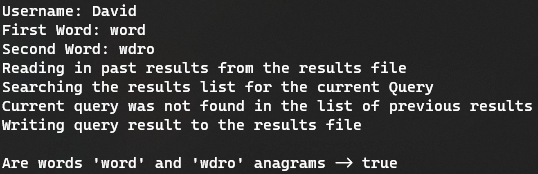

# AnagramChecker

AnagramChecker is a Java program compiled and unit tested using the gradle build automation tool and the junit testing framework. 

## Overview
- Program takes in a particular UserQuery from the console, consisting of [username, first word, second word].
- If not seen before (i.e. not in the previously run results list) then this query is carried out.
- The number of each character in either word is calculated. If equal then the words are anagrams.
- The query and its result is then appended to a text file of previously run queries and their results.

## Requirements
- Gradle 7.5.1
- junit 4.13.2 (Gradle will automatically download this during the local build of the project)
- Built using Java SE 18 however any version above 11 should be compatible.

### Using the program
- To run the program, compile using gradle with the command:
[-q to suppress all non error logs]
[--console plain to force gradle to compile a plain (no colour/rich output) console application]
```sh
./gradlew -q --console plain run
```
- Then follow the onscreen prompts to enter a query, an example is shown below
- To run the junit tests generated for this project use the command:
```
./gradlew test
```
### Assumptions Made:
- Case is to be ignored when comparing two words for the presense of an anagram. 
i.e. "AbC" is an anagram of "aBc" despite different cases occuring.
- If two Strings contain the same number of each character then they are anagrams of each other. Whether or not the two Strings are actually words contained within a dictionary was ignored for this project. For instance, while 'abb' and 'bba' are considered anagrams by this program neither one is a real word.

### Screenshot of a user entering a query:

